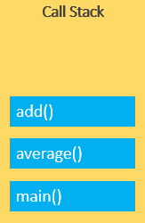

# Readings: In memory storage

## **What is a ‘call’?**

function invocation.

## **How many ‘calls’ can happen at once?**

one.

## **What does LIFO mean?**

**LIFO**: principle to temporarily store and manage function invocation (call).

**LIFO**: When we say that the call stack, operates by the data structure principle of Last In, First Out, it means that the last function that gets pushed into the stack is the first to be pop out, when the function returns.

## **Draw an example of a call stack and the functions that would need to be invoked to generate that call stack.?**

## **What causes a Stack Overflow?**

stack overflow occurs when there is a recursive function (a function that calls itself) without an exit point.

----------

**To know more please 
[visit this page](https://www.freecodecamp.org/news/understanding-the-javascript-call-stack-861e41ae61d4/)**

----------
## JavaScript error messages && debugging

## **What is a ‘refrence error’?**

Is an object represents an error when a non-existent variable is referenced.

## **What is a ‘syntax error’?**

An exception caused by the incorrect use of a pre-defined syntax. Syntax errors are detected while compiling or parsing source code.

## **What is a ‘range error’?**

Is an object indicates an error when a value is not in the set or range of allowed values.

## **What is a ‘tyep error’?**

The `TypeError` object represents an error when an operation could not be performed, typically (but not exclusively) when a value is not of the expected type.

## **What is a breakpoint?**

a breakpoint is an intentional stopping or pausing place in a program, put in place for debugging purposes. It is also sometimes simply referred to as a pause. 

## **What does the word ‘debugger’ do in your code?**

The `debugger` statement invokes any available debugging functionality, such as setting a breakpoint.
If no debugging functionality is available, this statement has no effect. 

----------

**To know more please 
[visit this Page](https://codeburst.io/javascript-error-messages-debugging-d23f84f0ae7c)**

----------

